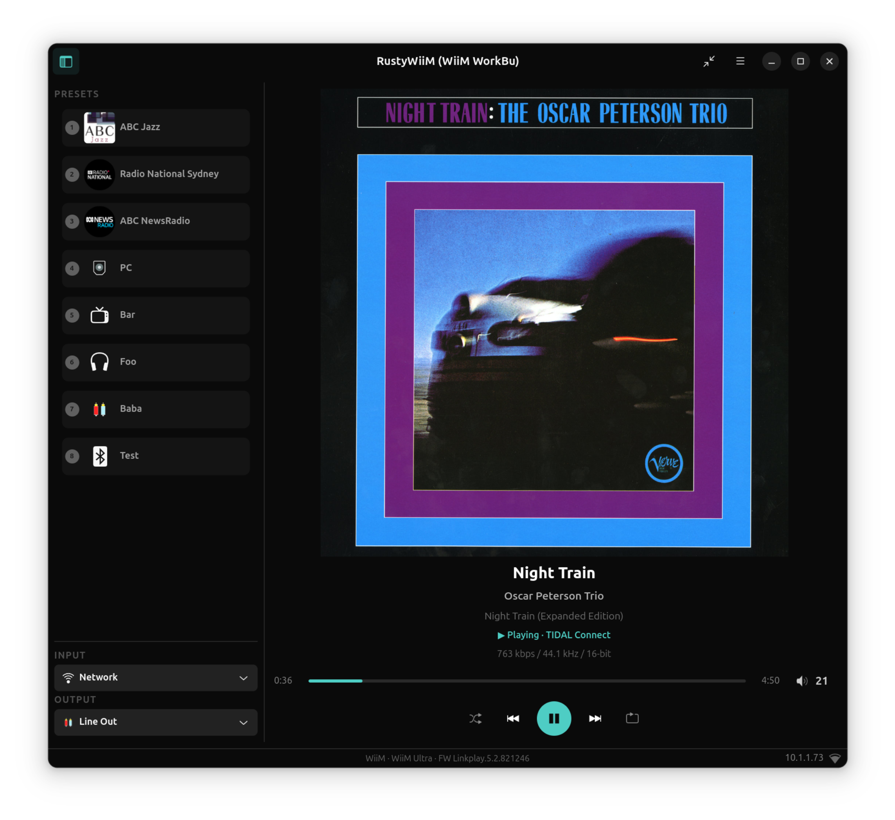
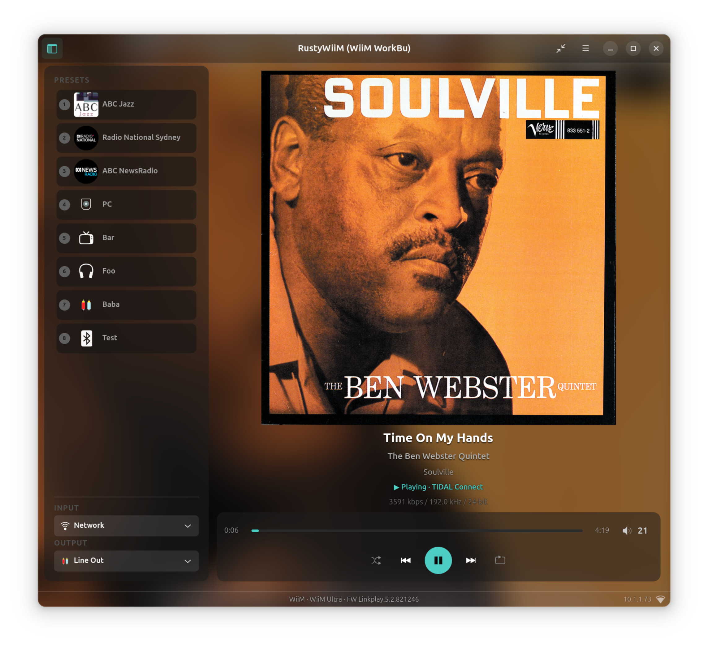
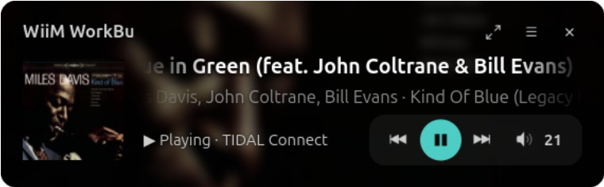
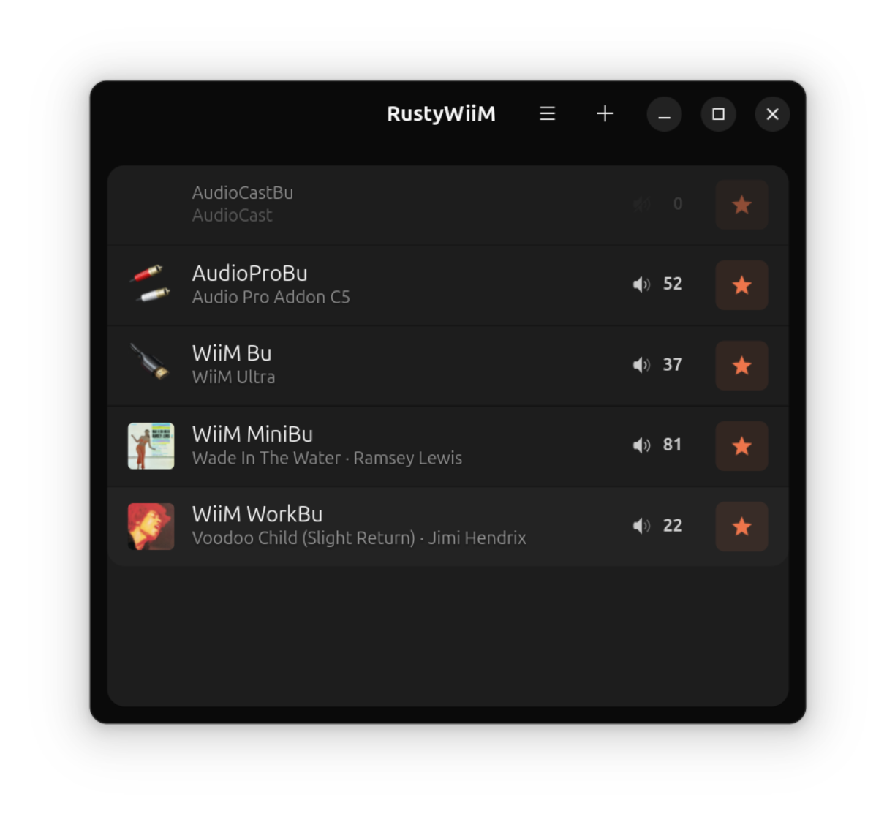
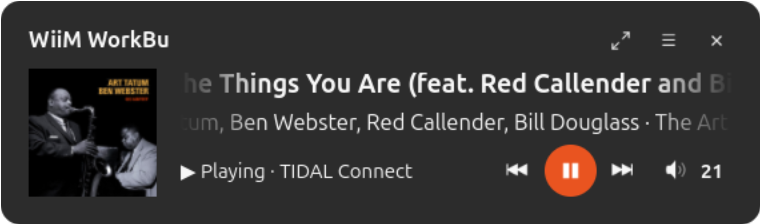
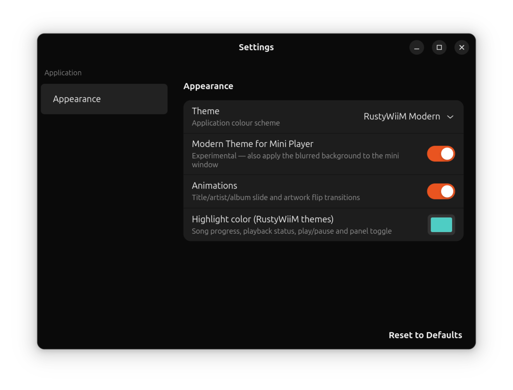

# RustyWiiM

A simple Linux GTK4 front-end for WiiM media players written in Rust.

Copyright (c) 2026 Benjamin Herrenschmidt

Licensed under the [MIT License](LICENSE).

This started as an exercise in using AI to program in Rust which I am not familiar with, so trying to both build experience with driving AI and learn a bit of Rust...

The former is a hit, the latter, less so, at least initially as the AI did too well :-)

Now, though, as the project slowly evolves (matures ?), I'm getting more involved with the code, and while a lot is still written by AI, it's under much more precise directions, ie the amount of "slop" is hopefully decreasing. As a result I am slowly learning Rust, ah !

## Build instructions ##

### Install dependencies ###

#### Ubuntu / Debian ####
`sudo apt-get install cargo rustc libgtk-4-dev libadwaita-1-dev libssl-dev libglib2.0-dev-bin`

#### Fedora ####
`sudo dnf install cargo rust gtk4-devel libadwaita-devel openssl-devel glib2-devel`

### Build ###
`cargo build`

### Run ###
`target/debug/rustywiim`

There is no installer or package yet and you can of course build a release build rather than a debug build etc... but since it's all pretty wet behind the ears, those simple instructions will do.

## Options ##
For now just this one:

| Option              | Description                                                                                                                                                              |
|:--------------------|:-------------------------------------------------------------------------------------------------------------------------------------------------------------------------|
| `--debug=<options>` | Comma-separated list of debug/tracing options: `api` (dump API calls), `state` (state change messages), `device` (device capabilities detection), `discovery` (the discovery machinery), `ui` (parts of the GUI code), `all` (all of the above) |
| `--tls=<mode>`      | Override TLS mode: `wiim` (default), `audio-pro`, `any`, `http`                                                                                                         |
## Helping with your device ##

Since I can only really test here with a WiiM Ultra and the implementation of the API seems to vary fairly wildly from device to device (or FW version to FW version), I have added a little tool that gets built in `target/debug/wiim-capture`.

You call it by passing the IP address of your device as an argugment, for example:

`wiim-capture 192.168.1.38`

It will send a number of non-destructive commands to the device (basically all "get" type commands), and generate a large JSON file called "<model>_<date>_<time>.json", for example "WiiM_Ultra_20260704_104058.json". Unless I missed some, all the MAC addresses, IP addresses, SSIDs, UUIDs etc... (identifying information) should be sanitized out.

You can pretty-print this file using `target/debug/wiim-capdump`. I would appreciate capture files sent to me (benh@kernel.crashing.org) so I can keep a collection. For now any device that isn't a WiiM Ultra, I will update this once I have enough of them with more precise asks. Please also let me know if you are ok with me shipping the file in a future version since I plan to build some testing infrastructure using those capture files. Thanks !

## Known issues ##

* There's an occasional row of stale pixels at the top of the scrolling song title in the miniaturized window. This happens with older gtk versions such as the one in Ubuntu 24.04 and is related to bugs in the gtk4 renderer. I have tried various workarounds but so far without great success. I'll investigate replacing some of this code with direct cairo rendering, see if that helps.

## Events ##

  * 0.1.0 - 2026-06-24
    * Initial release 0.1.0

  * 0.2.0 - 2026-06-25
    * Sorry, had to rebase ! Initial commit had to be fixed up.
    * Significant internal refactoring, code is a lot cleaner now, smaller
      functions, better abstractions, better detection of device capabilities,
      inputs and outputs etc... Should work better with other devices.

  * 0.3.0 - 2026-06-27
    * New mini-window mode
    * Various GUI cleanups, fixes and improvements
    * Support using system themes or our custom dark theme via a (primitive) settings dialog
    * Rate limit some API calls and add retries on request failures caused by disconnections
    * Additional implementation cleanups, still plenty of AI slop but slowly getting better

  * 0.4.0 - 2026-06-30
    * A whole lot of internal shuffling and cleaning up, various bug fixes, etc...
    * There is now a "Devices list" window. It will be displayed on launch in absence of
      existing opened window in the config, and can be opened via the menu otherwise. It
      replaces the old device selection popover. As a result it is now possible to open
      multiple device windows. Each device entry has a "pin" button (currently a star but
      that might change). This forces the device to remain listed even if it is not
      responding on the network. There is a + button to add devices via manual IP entry
      (they will be pinned by default).
    * Song title, album & artist fields are now scrollable. When they are too big to fit
      the window they will slowly scroll.
    * Note: There have been significant changes to the config file format, it's unlikely
      that previous settings will be preserved.

  * 0.4.1 - 2026-06-30
    * Fix (again, maybe for real now ?) refresh of all windows when changing theme
      [EDIT: FAIL ! It didn't fix it]

  * 0.4.2 - 2026-06-30
    * Really fix the refresh of all windows and widgets on theme switch ! So far it does
      seem to work even when starting the app with the custom dark theme.
    * Various small cosmetic and UI behaviour adjustments
    * Fix auto-reopening on windows for non-pinned devices

  * 0.4.3 - 2026-06-30
    * Fix name/model display in device list for non pinned devices

  * 0.5.0 - 2026-07-02
    * Small cosmetic improvements (volume button, rendering glitches, slightly
      bigger fonts and less dim text).
    * Should properly fix stale artwork when switching to a song with no artwork
    * A whole lot of internal implementation cleanups, optimisations and fixes.

  * 0.6.0 - 2026-07-02
    * Add animations (song transitions and side panel open/close)
    * Add a new "modern" theme with blurry art background and transparency
    * A few cosmetic tweaks here or there
    * Hammer the WiiM a bit less on poll
    * Mini window is horizontally resizable

  * 0.6.1 - 2026-07-03
    * Rework mini-window resize to avoid compositor maximization (side effect: it
      can only be resized from the right hand edge, not the left hand one).
    * Add key shortcuts (left & right for prev & next, space for play/pause, up & down
      for volume and M for minimize/maximize).
    * When closing the last window, don't save it as closed. The app will quit and
      will be re-launched with that window opened instead of the device-list now.

  * 0.6.2 - 2026-07-04
    * Make modern theme the default
    * Add wiim-capture and wiim-capdump for creating/viewing command capture files

  * 0.6.3 - 2026-07-05
    * Remove remaining target_ip field from capture files

  * 0.6.4 - 2026-07-06
    * Add basic wiim-simulator (work in progress) for testing purposes
    * Major cleanup of the handling of the player state to better abstract the
      backend from the UI, some prep work towards being able to use UPnP for
      player status which seems to be what the WiiM official app does.
    * Fix WiiM Amp Ultra detection and outputs handling
    * Fix name and icon for "Speaker" output for other "Amps" models

## Screenshots ##

