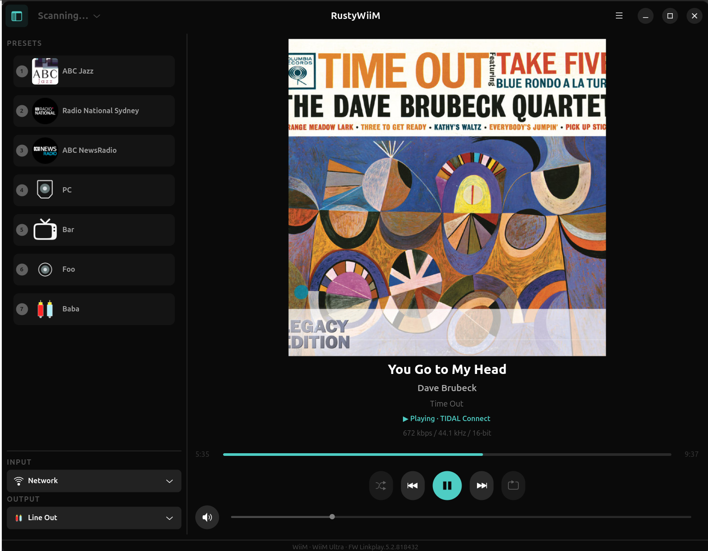

# RustyWiiM

A simple Linux GTK4 front-end for WiiM media players written in Rust.

Copyright (c) 2026 Benjamin Herrenschmidt

Licensed under the [MIT License](LICENSE).

This was almost entirely written with the help of an AI tool and using quite a lot of "inspiration" from https://github.com/mjcumming/pywiim (and in some case translating the python code almost verbatim). My own contribution is mostly to direct the AI and some additional API reverse engineering beyond what I could find in pywiim.

This was mostly an exercise for me in using AI to program in a language I am not (yet) familiar with (Rust). The AI is so good I barely learned any Rust at this point but since the end result might be useful to some, here it is.

