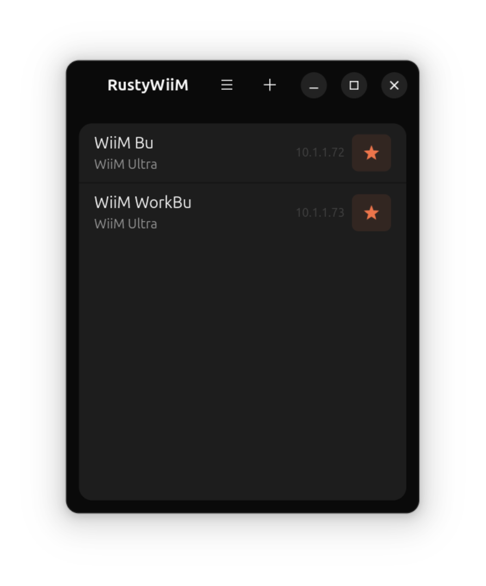

# RustyWiiM

A simple Linux GTK4 front-end for WiiM media players written in Rust.

Copyright (c) 2026 Benjamin Herrenschmidt

Licensed under the [MIT License](LICENSE).

This started as an exercise in using AI to program in Rust which I am not familiar with, so trying to both build experience with driving AI and learn a bit of Rust...

The former is a hit, the latter, less so, at least initially as the AI did too well :-)

Now, though, as the project slowly evolves (matures ?), I'm getting more involved with the code, and while a lot is still written by AI, it's under much more precise directions, ie the amount of "slop" is hopefully decreasing. As a result I am slowly learning Rust, ah !

## Build instructions ##

### Install dependencies ###

#### Ubuntu / Debian ####
`sudo apt-get install cargo rustc libgtk-4-dev libadwaita-1-dev libssl-dev`

#### Fedora ####
`sudo dnf install cargo rust gtk4-devel libadwaita-devel openssl-devel`

### Build ###
`cargo build`

### Run ###
`target/debug/rustywiim`

There is no installer or package yet and you can of course build a release build rather than a debug build etc... but since it's all pretty wet behind the ears, those simple instructions will do.

## Options ##
For now just this one:

| Option              | Description                                                                                                                                                              |
|:--------------------|:-------------------------------------------------------------------------------------------------------------------------------------------------------------------------|
| `--debug=<options>` | Comma-separated list of debug/tracing options: `api` (dump API calls), `state` (state change messages), `device` (device capabilities detection), `all` (all of the above) |
| `--tls=<mode>`      | Override TLS mode: `wiim` (default), `audio-pro`, `any`, `http`                                                                                                         |

## Known issues ##

* There's an occasional row of stale pixels at the top of the scrolling song title in the miniaturized window. This happens with older gtk versions such as the one in Ubuntu 24.04 and is related to bugs in the gtk4 renderer. I have tried various workarounds but so far without great success. I'll investigate replacing some of this code with direct cairo rendering, see if that helps.

## Events ##

  * 0.1.0 - 2026-06-24
    * Initial release 0.1.0

  * 0.2.0 - 2026-06-25
    * Sorry, had to rebase ! Initial commit had to be fixed up.
    * Significant internal refactoring, code is a lot cleaner now, smaller
	  functions, better abstractions, better detection of device capabilities,
	  inputs and outputs etc... Should work better with other devices.

  * 0.3.0 - 2026-06-27
    * New mini-window mode
	* Various GUI cleanups, fixes and improvements
	* Support using system themes or our custom dark theme via a (primitive) settings dialog
	* Rate limit some API calls and add retries on request failures caused by disconnections
    * Additional implementation cleanups, still plenty of AI slop but slowly getting better

  * 0.4.0 - 2026-06-30
    * A whole lot of internal shuffling and cleaning up, various bug fixes, etc...
	* There is now a "Devices list" window. It will be displayed on launch in absence of
	  existing opened window in the config, and can be opened via the menu otherwise. It
	  replaces the old device selection popover. As a result it is now possible to open
	  multiple device windows. Each device entry has a "pin" button (currently a star but
	  that might change). This forces the device to remain listed even if it is not
	  responding on the network. There is a + button to add devices via manual IP entry
	  (they will be pinned by default).
    * Song title, album & artist fields are now scrollable. When they are too big to fit
	  the window they will slowly scroll.
    * Note: There have been significant changes to the config file format, it's unlikely
	  that previous settings will be preserved.

  * 0.4.1 - 2026-06-30
    * Fix (again, maybe for real now ?) refresh of all windows when changing theme

## Screenshots ##

