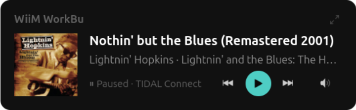
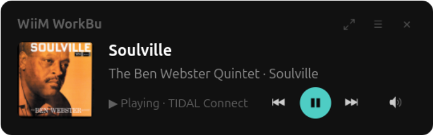

# RustyWiiM

A simple Linux GTK4 front-end for WiiM media players written in Rust.

Copyright (c) 2026 Benjamin Herrenschmidt

Licensed under the [MIT License](LICENSE).

This started as an exercise in using AI to program in Rust which I am not familiar with, so trying to both build experience with driving AI and learn a bit of Rust...

The former is a hit, the latter, less so, at least initially as the AI did too well :-)

Now, though, as the project slowly evolves (matures ?), I'm getting more involved with the code, and while a lot is still written by AI, it's under much more precise directions, ie the amount of "slop" is hopefully decreasing. As a result I am slowly learning Rust, ah !

## Build instructions ##

### Install dependencies ###

#### Ubuntu / Debian ####
`sudo apt-get install cargo rustc libgtk-4-dev libadwaita-1-dev libssl-dev`

#### Fedora ####
`sudo dnf install cargo rust gtk4-devel libadwaita-devel openssl-devel`

### Build ###
`cargo build`

### Run ###
`target/debug/rustywiim`

There is no installer or package yet and you can of course build a release build rather than a debug build etc... but since it's all pretty wet behind the ears, those simple instructions will do.

## Options ##
For now just this one:

| Option              | Description                                                                |
|:--------------------|:---------------------------------------------------------------------------|
| `--debug=<options>` | Comma-separated list of debug/tracing options to enable, supported values: |
|                     |  - `api     ` : Dump all API calls                                         |
|                     |  - `state   ` : Debug state change messages                                |
|                     |  - `device  ` : Debug device details and capabilities                      |
|                     |  - `all     ` : All of the above                                           |

## Events ##

  * 0.1.0 - 2026-06-24
    * Initial release 0.1.0

  * 0.2.0 - 2026-06-25
    * Sorry, had to rebase ! Initial commit had to be fixed up.
    * Significant internal refactoring, code is a lot cleaner now, smaller
	  functions, better abstractions, better detection of device capabilities,
	  inputs and outputs etc... Should work better with other devices.

  * 0.3.0 - 2026-06-27
    * New mini-window mode
	* Various GUI cleanups, fixes and improvements
	* Support using system themes or our custom dark theme via a (primitive) settings dialog
	* Rate limit some API calls and add retries on request failures caused by disconnections
    * Additional implementation cleanups, still plenty of AI slop but slowly getting better

## Screenshots ##

